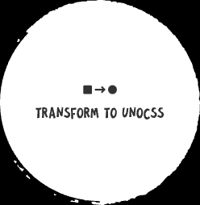

 English | <a href="./README_zh.md">简体中文</a>

vscode webview transformToUnocss, Query the writing method of css corresponding to unocss in vscode

## :coffee:

[buy me a cup of coffee](https://github.com/Simon-He95/sponsor)

## License

[MIT](./license)
